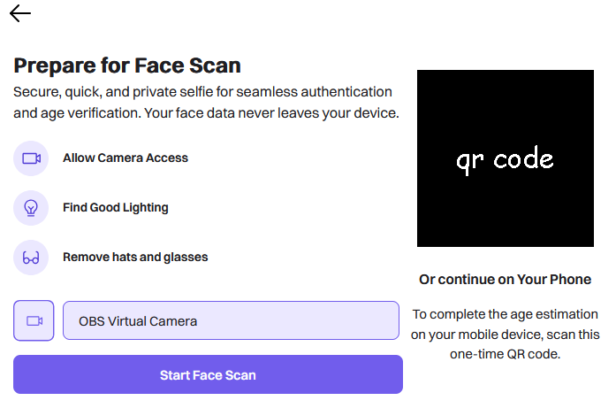

### discord k-id verification bypass

first, a little rant.

the [uk online safety act](https://www.gov.uk/government/publications/online-safety-act-explainer/online-safety-act-explainer) is a broken piece of legislation, built on the misguided ideas of politicians who think the internet works like television.

on paper it makes platforms verify ages. sounds fine, right? in practice it pushes services like discord into performing clumsy, invasive checks that do more harm than good.

beyond the obvious privacy nightmare, it's already shutting down smaller companies ([see the list](https://onlinesafetyact.co.uk/in_memoriam/)) and stripping away anonymity. users are forced to link accounts to their real life identity - so when leaks happen, it's not just usernames but passports, faces, and personal details on the line, like in the recent [tea app data breach](https://www.404media.co/women-dating-safety-app-tea-breached-users-ids-posted-to-4chan/).

everyone knows you can just use a [vpn](https://www.bbc.co.uk/news/articles/cn72ydj70g5o), they became the most downloaded apps overnight. but if the government can force id checks today, what's stopping them from banning vpns tomorrow?

**what this is**

this tool bypasses discord's id verification. discord uses k-id, which relies on privately to verify your age - meaning at least three companies handle your sensitive data, not counting any additional service providers involved.

if you want to avoid submitting your id or a face scan to discord, you can use this tool to skip the verification prompt.

**how to use it**

1. in discord, start the age verification process until you get to the qr code / face scan screen.
2. on your phone, go to https://verifier.amplitudes.me.
3. use your phone to scan the qr code on your computer screen.

that's it. the prompt should go away for good.

---

_a note: discord, k-id or privately could change things and this might break. use it while you can. i'm not responsible for what happens to your account._
