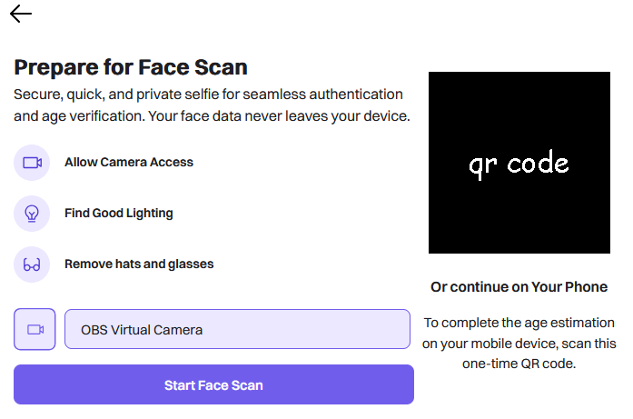

### discord k-id verification bypass

the [uk online safety act](https://www.gov.uk/government/publications/online-safety-act-explainer/online-safety-act-explainer) is a bad piece of legislation enacted by politicians who don't understand how the internet works.

on paper, it requires social media companies to verify the age of their users. sounds fine, right? but in practice, it just means platforms like discord have to implement invasive and clumsy verification processes to cover their own backs.

it's not just a privacy nightmare for users - it's a huge burden on companies, especially smaller ones. the implementation costs are so high that many have already been forced to shut down their services in the uk entirely. ([see the list here](https://onlinesafetyact.co.uk/in_memoriam/)).

this whole thing is a direct attack on anonymity. it pushes for linking your real-world identity to your digital one and opens the door for your data to be misused or breached. and these breaches happen all the time - just look at what happened with the recent [tea app data breach](https://www.404media.co/women-dating-safety-app-tea-breached-users-ids-posted-to-4chan/). your data is never as safe as they claim.

anyone wanting to get around it knows they can just install a vpn, but the fact that you have to do that in the first place is ridiculous. it's a slippery slope - today they force id checks, tomorrow they could come after the vpns themselves.

**what this is**

this tool bypasses discord's id verification. discord uses k-id, which relies on privately to verify your age - meaning at least three companies handle your sensitive data, not counting any additional service providers involved.

if you want to avoid submitting your id or a face scan to discord, you can use this tool to skip the verification prompt.

**how to use it**

1. in discord, start the age verification process until you get to the qr code / face scan screen.
2. on your phone, go to https://verifier.amplitudes.me.
3. use your phone to scan the qr code on your computer screen.

that's it. the prompt should go away for good.

---

_a note: discord, k-id or privately could change things and this might break. use it while you can. i'm not responsible for what happens to your account._
